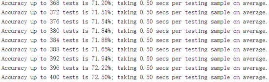

# 报告

------

## 一、实验题目
视网膜OCT图像分类

---

## 二、实现内容

1. 图像预处理
2. 图像特征提取
3. 图像分类

---

## 三、实验过程

###  图像预处理
1. 采用三维滤波(BM3D)去噪方法对原始图像进行降噪处理
  + BM3D流程图
    
  - BM3D处理后不仅有一个较高的信噪比，而且视觉效果也很好。BM3D分为两步，基本估算和最终估算，两步除协同过滤不同外，其余子步骤近似。
  	- 基本估算：逐块估计，对目标块进行分组，在目标块周围的一定区域，为目标块找到相似块集合，使用硬阈值定义相似性，得到的集合无顺序限制。对每一个相似块集合做3D线性变换，通过对变换域的系数进行硬阈值处理减弱噪声，在逆变换回原始块域。最终加权平均相似块，叠加后得到基本估算后的目标块。		
  	- 最终估算：逐块估计，对目标块进行分组，在目标块周围的一定区域，为目标块找到相似块集合，使用基本估算过程中的相似块集合，和基本估算处理后重新计算的相似块集合。使用维纳滤波处理，对形成的两个相似块集合做3D线性变换，以基础估计图像中的能量谱作对含噪三维数组进行维纳滤波，然后逆变换得到组中所有图像块的估计。最终加权平均相似块，聚合得到最终估算后的目标块。

2. 对降噪后的图像进行填充，使用阈值过滤去燥后的图像	
  - 图像填充：部分数据的形状不规则，例如会有白边，需要进行图像填充方便后续处理。
  - 阈值过滤：使用阈值过滤填充后的图像，使用平均值作为阈值，对图像进行二值化处理，得到二值图像。

3. 使用中位滤波器去除视网膜内脱落的黑点 	 
  - 中值滤波：基本原理是把数字图像或数字序列中一点的值用该点的一个邻域中各点值的中值代替，让周围的像素值接近的真实值，从而消除孤立的噪声点。其对脉冲噪声有良好的滤除作用，特别是在滤除噪声的同时，能够保护信号的边缘，使之不被模糊。
     
  - 使用中值滤波的方法对二值图像进行处理，可以去除视网膜内脱落的黑点。 

4. 保留图片最大连通域

  - 此时的图片由于填充和阈值过滤的原因，可能形成范围较大的噪声，不能通过优化的方式去处理。因此使用保留图片最大连通域，通过与质心之间的距离作为是否删除该连通域的条件，最终得到图像中最大连通域。

5. 采用形态学开运算去除视网膜外脱落的白点
  - 形态学开运算：图像依次经过腐蚀、膨胀处理后的过程。图像被腐蚀后，去除了噪声，但是也压缩了图像；接着对腐蚀过的图像进行膨胀处理，可以去除噪声，并保留原有图像。
     
  - 通过形态学开运算的方法，设置合适大小的卷积核，去除视网膜外脱落的白点。

6. 使用形态学闭运算用于去除视网膜内较大的黑色斑点
  - 形态学闭运算：图像依次经过膨胀、腐蚀处理后的过程。图像先膨胀，后腐蚀，它有助于关闭前景物体内部的小孔，或物体上的小黑点。
     
  - 使用形态学闭运算的方法，设置合适大小的卷积核，去除视网膜内较大的黑色斑点。

7. 对处理后的数据点进行拟合

  - 拟合流程图
     
  - 提取数据点集，求出中间数据点集和底部数据点集。对每一列选取x坐标，将每个x坐标对应的所有y坐标求平均值得到中间数据点，将所有数据点汇总得到中间数据点集，对于每个x坐标取对应的最小y坐标得到底部数据点，将所有数据点汇总得到底部数据点集。
  - 选择数据点集。对中间数据点集使用二阶多项式拟合，判断抛物线开口，如果开口向上，选择中间数据点集，如果开口向下，选择底部数据点集。
  - 对选择的数据点集进行拟合、，进行二阶多项式拟合和线性拟合，采用两种中相关系数较大的方法。若选中间数据点，则进行二阶多项式拟合；若选底部数据点，进行二阶多项式拟合和线性拟合，若二阶多项式拟合开口向上，则选择两种拟合选择相关系数更大的方法，若二阶多项式拟合开口向下，采用线性拟合的方法。

8. 归一化，裁剪 
  - 归一化，将视网膜对齐到一个相对统一的形态学位置来归一化视网膜。根据拟合曲线将图像的每一列移动一定距离，使视网膜变平。
  - 裁剪，裁剪图像以去除不重要的空间。视网膜对齐后，裁剪中间的特征部分。

###  图像特征提取

1. 使用SIFT和K-Means方法进行特征提取
    - SIFT：尺度不变特征变换，是用于图像处理领域的一种描述。这种描述具有尺度不变性，可在图像中检测出关键点，是一种局部特征描述子。SIFT特征是基于物体上的一些局部外观的兴趣点而与影像的大小和旋转无关。对于光线、噪声、微视角改变的容忍度也相当高。其具有区分性好、多量性、高速性、可扩展性的优点。
    - K-Means：k均值聚类算法，是一种迭代求解的聚类分析算法，其步骤是随机选取K个对象作为初始的聚类中心，然后计算每个对象与各个种子聚类中心之间的距离，把每个对象分配给距离它最近的聚类中心。聚类中心以及分配给它们的对象就代表一个聚类。
    - 将每个裁剪后的OCT图像提取出SIFT描述符。
    - 使用K-mean分类，将所有训练数据都适应于k个聚类中心进行聚类，得到大小为(k, 128)的聚类字典。
    - 对于训练集中的每一张图片，统计SIFT描述符中k个聚类的“词频”，得到相应的直方图。
    - 将直方图作为样本向量即可构建训练数据和测试数据。 

2. PCANet特征
	- PCANet
     这个框架主要依赖几个基本的数据处理方法：1）主成分分析PCA。2）二值化哈希编码。3）分块直方图。在这个框架中，首先通过PCA方法来学习多层滤波器核，然后使用二值化哈希编码以及块直方图特征来进行下采样和编码操作。

	- PCANet网络结构
     
		+ 第一层（PCA）：
       对于每个像素，我们都在其周围进行一次k1*k2的块采样（这里采样时逐个像素进行的，因此是完全的覆盖式采样），然后收集所有的采样块，进行级联，作为第i张图片的表示，接下来需要对采样得到的块进行零均值化。然后对训练集中的其他图片也做相同处理，最终得到处理后的训练样本矩阵：
       

       假定在第i层的滤波器数量为Li，PCA算法的目的就是通过寻找一系列的标准正交矩阵来最小化重构误差：
       

       接着就是经典的主成分分析，即矩阵X的协方差矩阵的前n个特征向量，因此对应的PCA滤波器表示如下：
       

       这个方程的含义就是提取X的协方差矩阵的前L1个最大特征值对应的特征向量来组成特征映射矩阵。这些主成分中保留了这些零均值的训练样本的主要信息，通过提高网络层数来提取更为抽象的特征。

		+ 第二层（PCA）
       第二层的映射过程和第一层的映射机制基本相同，首先计算第一层的PCA映射输出，注意这里在计算卷积映射之前需要实现对样本进行边缘补零操作，以保证映射结果与原图像的尺寸相同（卷积操作会导致尺寸变小）。正如第一层中所做的分块操作，在第二层同样对输入矩阵（也就是第一层的映射输出）进行块采样、级联、零均值化，对每个输入矩阵都进行上述操作，最终得到第二层输入数据的块采样形式。同理，第二层的PCA滤波器同样通过选取协方差矩阵对应的特征向量来组成：

       
       由于第一层具有L1个滤波器核，一次第一层会产生L1个输出矩阵，在第二层中针对第一层输出的每一个特征举证，对应都产生L2个特征输出。最终对于每一张样本，二阶PCANet都会产生L1*L2个输出的特征矩阵：

       

		+ 输出层（哈希编码和直方图处理）
       我们对第二层的每个输出矩阵都进行二值处理，得到的结果中只包含整数和零，然后在对其进行二值化哈希编码，编码位数与第二层的滤波器个数相同：
       

       这里的函数H类似于一个单位阶跃函数。经过上述处理，每个像素值都被编码成为（0,255）之间的整数（在L2=8的情况下）。当然这里的编码值与权重并没联系，因为我们将每个编码值都视为一个独立的关键字。
       对于第一层的每个输出矩阵，将其分为B块，计算统计每个块的直方图信息，然后在将各个块的直方图特征进行级联，最终得到块扩展直方图特征
       

###  图像分类
1. 支持向量机进行图像分类
  - 支持向量机：是一类按监督学习方式对数据进行二元分类的广义线性分类器。其优点有稳健性与稀疏性，但其不适合大量的数据样本。
  - 通过SIFT和K-Means方法进行特征提取的方式提取特征，使用支持向量机进行图像分类。
  - PCANet特征提取和线性支持向量机进行图像分类。

2. 随机森林进行图像分类
  - 随机森林：是一个包含多个决策树的分类器， 并且其输出的类别是由个别树输出的类别的众数而定。优点：可以处理大量的输入变数；可以在决定类别时，评估变数的重要性；对于不平衡的分类资料集来说，它可以平衡误差。
  - 通过SIFT和K-Means方法进行特征提取的方式提取特征，使用随机森林进行图像分类。

3. 残差神经网络（ResNet34）对图像进行分类

  + 残差神经网络：深度学习网络的深度对最后的分类和识别的效果有着很大的影响，所以正常想法就是能把网络设计的越深越好，但是事实上却不是这样，常规的网络的堆叠（plain network）在网络很深的时候，效果却越来越差了。其中原因之一即是网络越深，梯度消失的现象就越来越明显，网络的训练效果也不会很好。 但是现在浅层的网络（shallower network）又无法明显提升网络的识别效果了，所以现在要解决的问题就是怎样在加深网络的情况下又解决梯度消失的问题。
  + 通过在一个浅层网络基础上叠加 y=x 的层（称identity mappings，恒等映射），可以让网络随深度增加而不退化。这反映了多层非线性网络无法逼近恒等映射网络。但是，不退化不是我们的目的，我们希望有更好性能的网络。resnet学习的是残差函数F(x) = H(x) - x, 这里如果F(x) = 0, 那么就是上面提到的恒等映射。事实上，resnet是“shortcut connections”的在connections是在恒等映射下的特殊情况，它没有引入额外的参数和计算复杂度。假如优化目标函数是逼近一个恒等映射, 而不是0映射， 那么学习找到对恒等映射的扰动会比重新学习一个映射函数要容易。残差函数一般会有较小的响应波动，表明恒等映射是一个合理的预处理。
  + 本次实训所使用的ResNet34，是一个34层的神经网络，通过迁移学习应用到本次的实训的分类任务上。
  + 使用的训练集：https://www.kaggle.com/paultimothymooney/kermany2018/data
  + 对得到的训练集的图片进行处理，其处理过程为：去除图像白边->将图片降低分辨率->将图片变成224*224*3大小->数据归一化
  + 去除图像白边:因为数据集的图片很多都有白边，所以会对后续的图片处理造成一定的影响，所以在进行后续处理之前需要先对图片进行去除白边的处理，原理是选取一阈值，从上下左右四个方向对图片进行裁剪，将大部分白边去除，阈值选取为平均值加上一定比例的方差，当波动较大时方差会较大，阈值也会较大，裁剪的就会比较多，裁剪效果比较好，但可能会删去一部分需要用到的图片内容。
  + 降低图片分辨率：由于该神经网络需要输入（224,224,3）的图片，所以使用双三次插值算法将图片变成短边为224的图片。
  + 数据规范化：数据规范-Normalization是深度学习中我们很容易忽视，也很容易出错的问题。我们训练的所有数据在输入到模型中的时候都要进行一些规范化。例如在pytorch中，有些模型是通过规范化后的数据进行训练的，所以我们在使用这些预训练好的模型的时候，要注意在将自己的数据投入模型中之前要首先对数据进行规范化。
  + 预训练模型即模型中的权重参数都被训练好了，在构造模型后读取模型权重即可。
  + 之后将通过处理后的图片加载至神经网络中，主要是利用有监督的学习，通过存储图片的文件名来确定训练的图片的类型，以此来监督训练我们的模型，通过对损失函数的大小判断来保存最优模型，以此确保能在测试集上得到最好的结果。
  + 通过获取另外两名组员的处理后的图片，再经过差值改变图片分辨率和调整大小，再通过训练和测试得到结果进行比对。
  + 完成对上述过程的编码，使用的是python，利用pytorch。代码的具体实现在代码压缩包内，具体函数的功能都在注释中，具体运行方法见README中。

## 四、实验结果

###  图像预处理
- 根据上文叙述的预处理流程，将原图像预处理后得到裁剪后的去燥图像
   
    
   (a)原图像 (b)BM3D去燥后图像  (c)填充、使用阈值过滤后的图像 (d)中值滤波后的图像 (e)保留图像最大连通域 (f)形态学开运算 (g)形态学闭运算 (h)归一化 (i)对二值图像进行裁剪 (j)对原图像进行裁剪

### 特征提取
- 使用SIFT进行特征提取

###  图像分类
1. SIFT特征提取与支持向量机进行图像分类
  - 训练集数量 4000，训练集准确率  0.831
  - 测试集数量 1000， 测试集准确率  0.836

2. SIFT特征提取与随机森林进行图像分类
  - 训练集数量 4000，训练集准确率 0.844
  - 测试集数量 1000， 测试集准确率 0.825

3. 残差神经网络（ResNet34)训练对图像进行分类
  + 对下载数据集进行简单处理后的训练集的训练运行结果：可以看到训练的损失函数值为0.0348。

    + 

  + 在训练集中的一些值得预测结果：

    + 
    + 可以看到预测都是对的。

  + 将训练好的模型那测试集进行测试，同样的测试集也只进行了简单的处理：
    + 
    + 上图纵坐标表示的为图片的真实标签，横坐标为预测标签，在对角线上的就说明了预测值与真实值相等，说明预测正确，可以看到，预测正确的图片个数为：926，总个数为：965，预测的准确率为：95.95%。

  + 用处理过后的图片进行训练，共12000，其结果为：
    + 
    + 可以看到，损失函数值为0.0183，低于之前的损失函数值为0.0348。说明处理过后的图片训练效果明显提高。

  + 将训练好的模型用于处理后的图片，其结果为：
    + 
    + 上图纵坐标表示的为图片的真实标签，横坐标为预测标签，在对角线上的就说明了预测值与真实值相等，说明预测正确，可以看到，预测正确的图片个数为：980，总个数为：1000，预测的准确率为：98%，高于之前的训练准确率95.95%。说明处理过后的图片测试效果也得到了明显的提高。

4. PCANet特征提取和线性支持向量机进行图像分类
  - 训练集数量2000
  - 测试集400
  - PCANet测试参数

     

  - 图像分类测试过程
    
     

  - 图像分类测试结果
    

  - 测试错误率：27.50%， 测试准确率： 72.50%
    训练时间比较长，并且PCANet特征提取时，十分占内存。

---

## 五、参考文献
1. K. Dabov, A. Foi, V. Katkovnik, and K. Egiazarian, “[Image denoising by sparse 3D transform-domain collaborative filtering](https://ieeexplore.ieee.org/document/4271520),” IEEE Trans. Image Process., vol. 16, no. 8, pp. 2080-2095, August 2007.
2. M. Maggioni, E. Sánchez-Monge, and A. Foi, “[Joint Removal of Random and Fixed-Pattern Noise through Spatiotemporal Video Filtering](https://ieeexplore.ieee.org/document/6871339)”, IEEE Trans. Image Process., vol. 23, no. 10, pp. 4282-4296, October 2014.                       
3. Yankui Sun, Shan Li, Zhongyang Sun, “[Fully automated macular pathology detection in retina optical coherence tomography image/PCANet using sparse coding and dictionary learning](https://www.spiedigitallibrary.org/journals/Journal-of-Biomedical-Optics/volume-22/issue-01/016012/Fully-automated-macular-pathology-detection-in-retina-optical-coherence-tomography/10.1117/1.JBO.22.1.016012.full?SSO=1)”，J. of Biomedical Optics, 22(1), 016012 (2017)
4. Pratul P. Srinivasan, Leo A. Kim, Priyatham S. Mettu, Scott W. Cousins, Grant M. Comer, Joseph A. Izatt, and Sina Farsiu, "Fully automated detection of diabetic macular edema and dry age-related macular  degeneration from optical coherence tomography image/PCANet"
5. David G. Lowe, "[Distinctive image features from scale-invariant keypoints](https://www.cs.ubc.ca/~lowe/papers/ijcv04.pdf)", International Journal of Computer Vision, 60, 2 (2004), pp. 91-110. 
6. Yufan He,Aaron Carass,Yeyi Yun,Can Zhao,Bruno M. Jedynak,Sharon D. Solomon,Shiv Saidha,Peter A. Calabresi,Jerry L. Prince "[Towards Topological Correct Segmentation of Macular OCT from Cascaded FCNs](https://link.springer.com/chapter/10.1007/978-3-319-67561-9_23)",OMIA 2017, FIFI 2017: Fetal, Infant and Ophthalmic Medical Image Analysis pp 202-209
7. [pytorch官方教程](https://pytorch.org/tutorials/beginner/transfer_learning_tutorial.html
     )
8. Tsung-Han Chan,Kui Jia,Shenghua Gao, Jiwen Lu,Zinan Zeng, and Yi Ma.“PCANet: A Simple Deep Learning Baseline for Image Classification?”

